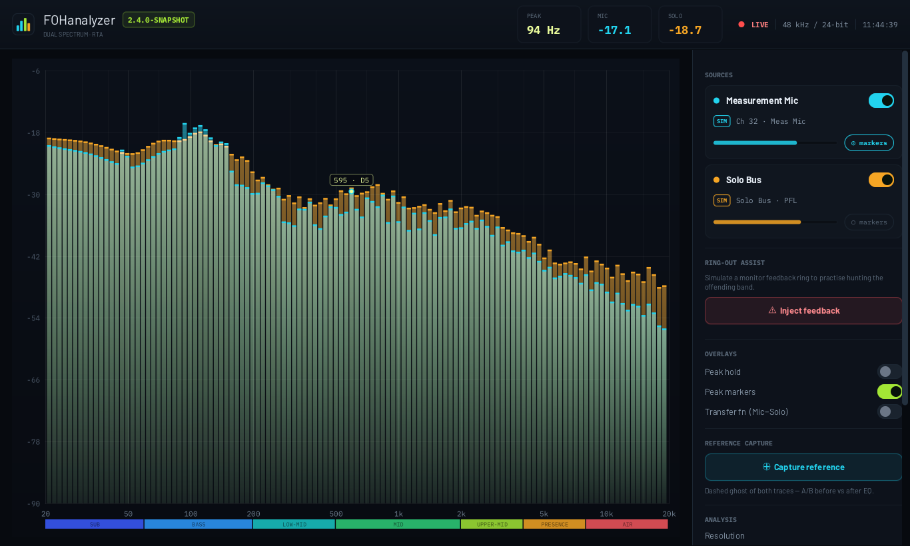
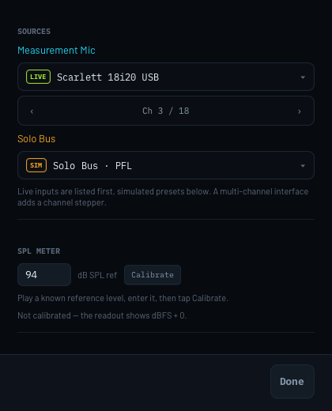

<p align="center">
  
</p>

<h1 align="center">FOHanalyzer</h1>

<p align="center">
  A native desktop dual-channel RTA for Front-of-House sound engineers.<br>
  Overlay a <b>measurement mic</b> against the console <b>solo bus</b> — read the room,
  hunt feedback, verify EQ, meter SPL.
</p>

<p align="center">
  <a href="https://github.com/d135-1r43/fohanalyzer-java/actions/workflows/build.yml">
    
  </a>
  
  
  
</p>

<p align="center">
  
</p>

## What it does

- **Two traces, one plot.** A measurement-mic trace (cyan) over a console solo-bus trace
  (amber), so room response and source signal are read against each other rather than in
  turn.
- **Ring-out assist.** With a live mic, *Detect ring* reports the actual ringing
  fundamental — not the band centre a peak marker rounds to — and suggests a cut. With a
  simulated mic, *Inject feedback* is a practice mode for the same workflow.
- **SPL metering.** Calibrate against a known reference level and the readout is real dB
  SPL rather than dBFS.
- **Peak hold, peak markers, transfer function.** Overlays for the mic−solo difference and
  for what the plot did while you were not looking.
- **Reference capture.** A dashed ghost of both traces, to A/B before against after EQ.
- **1/1 to 1/24 octave** resolution, with smoothing and frame averaging.
- **Runs on real hardware or simulated presets** — the simulator means the whole app is
  usable without an interface plugged in.

## Install

Grab the `.dmg` and drag FOHanalyzer to Applications — it ships its own Java runtime, so
**no JDK or Maven is needed** on the machine that runs it.

macOS will ask for microphone permission the first time you select a live input; that is the
measurement mic and console feeds, and without it the analyser has nothing to read.

> The bundle is ad-hoc signed, not notarised, so Gatekeeper on another Mac will refuse the
> first launch: right-click the app and choose **Open** to allow it. A Developer ID
> signature and notarisation would remove that step.

## Development

Needs **JDK 25+** (the current LTS; built and tested on Temurin 25) and **Maven 3.9+**.

```bash
mvn javafx:run   # run
mvn test         # test
```

`mvn test` and `mvn package` work even when `JAVA_HOME` points at an older JDK: the pom
selects an installed JDK 25+ as a toolchain and hands it to the compiler and the test JVM.
Running and packaging the app are not covered — `mvn javafx:run` reads the JavaFX jars inside
the JVM running Maven, and `jpackage` bundles whichever runtime it is invoked from — so for
those, put `JAVA_HOME` on 25 yourself:

```bash
export JAVA_HOME=$(/usr/libexec/java_home -v 25)   # macOS
```

The JUnit suites (`EngineTest`, `SignalStateTest`, `AudioDspTest`, `SettingsTest`) cover the
band math, note naming, formatting, simulation, averaging/smoothing/peak-hold/voicing, the
spectral (FFT/band/RMS) logic, and the settings store.

### Building the bundle

```bash
./scripts/package-mac.sh            # target/dist/FOHanalyzer-<version>.dmg
./scripts/package-mac.sh app-image  # just the .app — faster when iterating
```

Needs `JAVA_HOME` on JDK 25+; the script checks both `jpackage` and Maven's own JVM up front
and stops with the fix rather than producing a bundle that cannot load its own classes. The
script collects the runtime jars, renders the icon from the
in-app logo via `com.fohanalyzer.dev.IconRenderer`, and runs `jpackage`. See
[Packaging notes](#packaging-notes) for why it looks the way it does. CI runs the same script
on every push and attaches the `.dmg`; a semver tag publishes it as a release.

### Code style

The style is the Eclipse formatter profile in [`formatter/java.xml`](formatter/java.xml),
shared with the `nuusroom` project so both use one house style: tabs at width 4, braces on
their own line, and comments wrapped at 80 columns.

```bash
mvn formatter:format   # apply it
```

It is enforced, not suggested: `formatter-maven-plugin`'s `validate` goal runs in the
`validate` phase, so **any build fails if a source file is not formatted** — including
`mvn test` and `mvn package`.

One quirk worth knowing when writing comments: the profile sets `join_line_comments=false`,
so the formatter *splits* an over-long `//` line but never rejoins the remainder. A comment
wrapped for a wider margin ends up ragged, and an over-long trailing comment turns into a
deeply indented staircase. Keep `//` lines inside the 80-column budget (counting the tab
indent), and put a long comment on its own line above the statement rather than trailing it.

## How it works

| Package | Responsibility |
|---|---|
| `engine` | Frequency math, note names, formatting, signal simulation |
| `dsp` | Per-band averaging, smoothing, peak hold, stats |
| `audio` | Java Sound capture + TarsosDSP FFT and pitch detection, device enumeration |
| `ui` | JavaFX canvas rendering + render loop, app shell, control rail, preferences |
| `ui.controls` | Toggle, Segmented, Meter, SourceCard, ChannelSelect, Logo |

| Dependency | For | Licence |
|---|---|---|
| [JavaFX](https://openjfx.io) | UI toolkit and canvas | GPLv2 + Classpath Exception |
| [TarsosDSP](https://github.com/JorenSix/TarsosDSP) `core` | FFT, window functions, YIN pitch detection | **GPL-3.0** |
| [SLF4J](https://www.slf4j.org) api + simple | Logging | MIT |
| JUnit 5 | Tests only | EPL-2.0 |

### Audio capture

Live input is captured from a `javax.sound.sampled.TargetDataLine` on a daemon thread
into a 16384-sample ring buffer. Each frame, the latest window is Blackman-windowed and
transformed with TarsosDSP (`be.tarsos.dsp.util.fft.FFT` + `BlackmanWindow`); per-bin
magnitude is normalised by the FFT size and converted to dBFS. Choose a live device per
source in *Preferences*; multi-channel interfaces expose a channel stepper there. The rail
keeps a read-only line naming what each source is set to. SPL metering appears when the
measurement mic is a live input, and is calibrated from *Preferences* too.

TarsosDSP is not on Maven Central; the POM adds the author's repository
(`https://mvn.0110.be/releases`) and pulls `be.tarsos.dsp:core`, which has no transitive
dependencies. **It is GPL-3.0**, which is stricter than the rest of this project's
dependency set and is what fixes the licence below.

Only the `core` module is used. The `jvm` module's `AudioDispatcher` is deliberately not
used for capture: it consumes a mono stream, which would give up the per-channel selection
this app needs on multi-channel interfaces (Scarlett 18i20, Behringer Wing, …).

### Rail vs preferences

The rail is ordered by how often a hand reaches for something mid-show: the source traces
and what they read, then ring-out assist, the overlays, and the analysis settings
(resolution, smoothing, averaging) last. Everything decided once when the rig is patched —
which device feeds each source, and the SPL calibration — lives in a separate *Preferences*
window instead, so it is not competing for the column you have to read during a show.

The source cards still carry a read-only line naming the current selection, because "is
this trace live or simulated, and on which channel" is a question you ask at a glance while
working, even though the answer is only *set* once. Nothing in that window is a commit
step: the controls bind straight to the shared state that is persisted anyway, so there is
no OK/Cancel and nothing to apply.

<p align="center">
  
</p>

### Saved settings

SPL calibration, the selected inputs and channels, and the analysis/view options persist
between launches via `java.util.prefs.Preferences` — no config file of our own, no
dependency. Calibration is flushed to disk the moment it changes, since it is the expensive
thing to redo; the rest ride the periodic sync plus a flush on window close.

Stored values are validated on the way in: a resolution or averaging setting the segmented
controls cannot display, or a smoothing value outside the slider's range, falls back to the
default rather than putting the UI in an unrepresentable state.

A saved `live:<device>` input is only restored if that interface is actually present —
moving between rigs is the normal case, so a missing device quietly leaves the simulated
preset selected instead of pointing at a line that cannot be opened. A channel index saved
against an 18-in interface is clamped when it reopens on a 2-in one. *Reset saved settings*
at the foot of the rail clears everything back to defaults.

The preferences window remembers its own size and position, restored onto the stage rather
than the scene — the saved height is the outer window and includes the title bar, so
feeding it back into the scene would add that bar again on every launch. A position that no
longer lands on any display is ignored, which is the normal case for a laptop carried
between rigs.

### Ring-out assist

With a **live** measurement mic, *Detect ring from mic* runs TarsosDSP's `FastYin` over
the newest audio and logs the actual ringing fundamental, rather than the band centre the
peak markers round to. Four consecutive 2048-sample blocks are estimated independently and
the median is logged, so one glitched block cannot shift the frequency you go on to notch.
The suggested cut comes from how far the loudest band stands above the mic average. With a
simulated mic, only the *Inject feedback* practice mode is offered.

### Typography

Readouts, axis labels, and badges are set in **IBM Plex Mono**; UI text is set in
**Barlow**. Both families ship in `resources/com/fohanalyzer/fonts` (OFL-1.1, licences
included) and `Fonts.install()` registers them with JavaFX before the stylesheet is applied.
Without that step the app silently fell back to Helvetica Neue and Menlo.

Barlow stands in for **Saira** — the squarish technical grotesque the design calls for —
because Saira is only published as a variable font and JavaFX 21 could not select an axis
instance. That was measured against JavaFX 21 and has not been re-checked since the move to
26 — if it now resolves a named instance, the stand-in is no longer necessary. Saira is kept
next in the CSS stack for anyone who has it installed locally.
Regular and Bold are bundled per family; the SemiBold (600) faces are available from the
upstream font projects if the headings want a lighter weight.

### Version and logging

The version in the header chip and the rail footer is read from the jar manifest's
`Implementation-Version`, which `maven-jar-plugin` writes from the POM, so what is on screen
cannot drift from what the build stamped on the bundle. A run straight from `target/classes`
has no manifest and reports `dev`.

Logging goes through SLF4J with the `simple` binding — this app writes a handful of warnings
and dev-aid lines, so a full backend buys nothing, and both artifacts are MIT rather than
adding another licence to reconcile. `simplelogger.properties` trims the output to level,
short class name, and message.

### Implementation notes

- Audio devices are enumerated once at launch; there is no hot-plug notification.
- The Blackman window comes from TarsosDSP, which uses the symmetric definition
  (`cos(2πi/(N−1))`) rather than the periodic one (`cos(2πi/N)`). At the 16384-point window
  in use the two differ by ~1 part in 16k — far below the display resolution — and the
  spectral tests hold. The FFT itself is single- rather than double-precision for the same reason.
- Broadband RMS stays hand-rolled: TarsosDSP's `SilenceDetector.soundPressureLevel` divides
  energy by the buffer length instead of its square root, so it would not agree with the RMS
  the SPL readout is calibrated against.
- The UI components (Toggle/Segmented/Meter) have no unit tests — those controls are trivial
  and JavaFX UI testing would add disproportionate setup. Core logic is fully tested.

### Packaging notes

The app is deliberately **not** modular. `com.fohanalyzer.Main` is a plain launcher that
calls `Application.launch` on `MainApp`, which lets JavaFX run from the classpath. That
sidesteps the usual `jlink` dead end: TarsosDSP is an automatic module, and `jlink` refuses
to link those, so a modular build would have needed a synthesised `module-info` for a
third-party jar.

Because the app is non-modular, `jpackage` cannot infer what the runtime needs, so the
modules are listed explicitly. Two are easy to miss: **`java.desktop`** carries
`javax.sound.sampled`, without which there is no audio capture at all, and **`java.prefs`**
backs the saved settings. The resulting image is 7 modules, ~79 MB, giving an 88 MB `.app`
that compresses to a ~37 MB `.dmg`.

Two macOS specifics the script handles:

- **Microphone usage description.** macOS 10.14+ denies mic access unless `Info.plist` says
  why the app wants it. `jpackage` on JDK 25 writes a generic sentence and offers no flag for
  arbitrary keys, so the script rewrites the key with the real reason — that text is the
  prompt the user has to agree to.
- **Re-signing.** Editing `Info.plist` invalidates the ad-hoc signature `jpackage` applies,
  and arm64 macOS will not launch an unsigned bundle, so the script re-signs ad-hoc
  afterwards.

`jpackage` also takes only a numeric `X[.Y[.Z]]` app version and rejects a `-SNAPSHOT`
suffix, so the script hands it the stripped number and renames the `.dmg` back afterwards —
the file still says which build it came from.

The icon is rendered from the same `Logo` vector used in the header, at every size
`iconutil` wants, rather than downscaled from one bitmap — the bars are thin and resampling
turns the 16px variant to mush. It is also where [`docs/logo.png`](docs/logo.png) comes from.

### Dev aids

**CSS hot reload.** `FOH_DEV=true mvn javafx:run` watches
`src/main/resources/com/fohanalyzer/theme.css` and re-applies it to the running window on
save, so padding/colour/font work does not need a restart. Off by default — no watcher
thread exists in a normal run.

It reloads by copying the stylesheet to a fresh temp file and pointing the scene at that.
JavaFX keys its parsed-stylesheet cache on the URL string, so re-adding the same path — even
after `clear()` — can hand back the stale parse; a filename it has never seen sidesteps the
cache instead of relying on undocumented invalidation.

**Render probe.** `PROBE=true mvn javafx:run` boots the app, snapshots the window to
`target/probe-full.png` after ~2 s, and exits — handy for headless visual checks. Pass a
number for a longer delay (`PROBE=20`), e.g. to snapshot *after* a hot reload. The screenshot
at the top of this file is one of these.

## Licence

**GPL-3.0-or-later** — see [LICENSE](LICENSE). The choice is dictated by
[TarsosDSP](https://github.com/JorenSix/TarsosDSP), which is GPL-3.0: linking against it
means anything distributed here has to be GPL-compatible too.

The bundled fonts are **not** covered by that licence and keep their own:
IBM Plex Mono (© IBM Corp.) and Barlow (© The Barlow Project Authors) are both
[SIL Open Font License 1.1](https://openfontlicense.org), with the licence texts included
in `src/main/resources/com/fohanalyzer/fonts`. The OFL permits bundling them with an
application regardless of that application's own licence.
